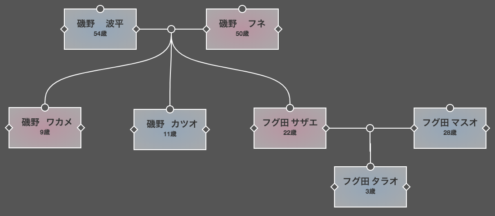

# family-tree

「family-tree」は家系図を作成するためのWebアプリです

## 特徴
* GUIで直感的に親族の追加や削除、関係性を示す線の描画が可能
* 編集した内容はJSONファイルとして書き出し、読み込みが可能
* SVGやPNGファイル形式で出力可能
* 無料アプリにあるような作成する世代数などの上限なし

## 使い方

 * viewエリアで右クリックすると「親族追加」や「グループ追加」ができます
 * 各ノードのひし形部分をクリックすると関係を示す線を描画することができます

### ショートカット

使用可能なショートカットは以下の通り

 * `Ctrl + Z`: 戻る
 * `Ctrl + Y`: 進む
 * `Ctrl + A`: 全選択
 * `Ctrl + click`: 複数選択
 * `Del`: 削除
 * `S`: 選択したアイテムを中心に表示
 * `E`: 全体表示

## 備考

 * 本プロジェクトは[AnnalisaDB/family-tree](https://github.com/AnnalisaDB/family-tree)からフォークし、日本語化等を実施したものになります
 * ライセンス等はAnnalisaDB/family-treeに準拠するものとします
